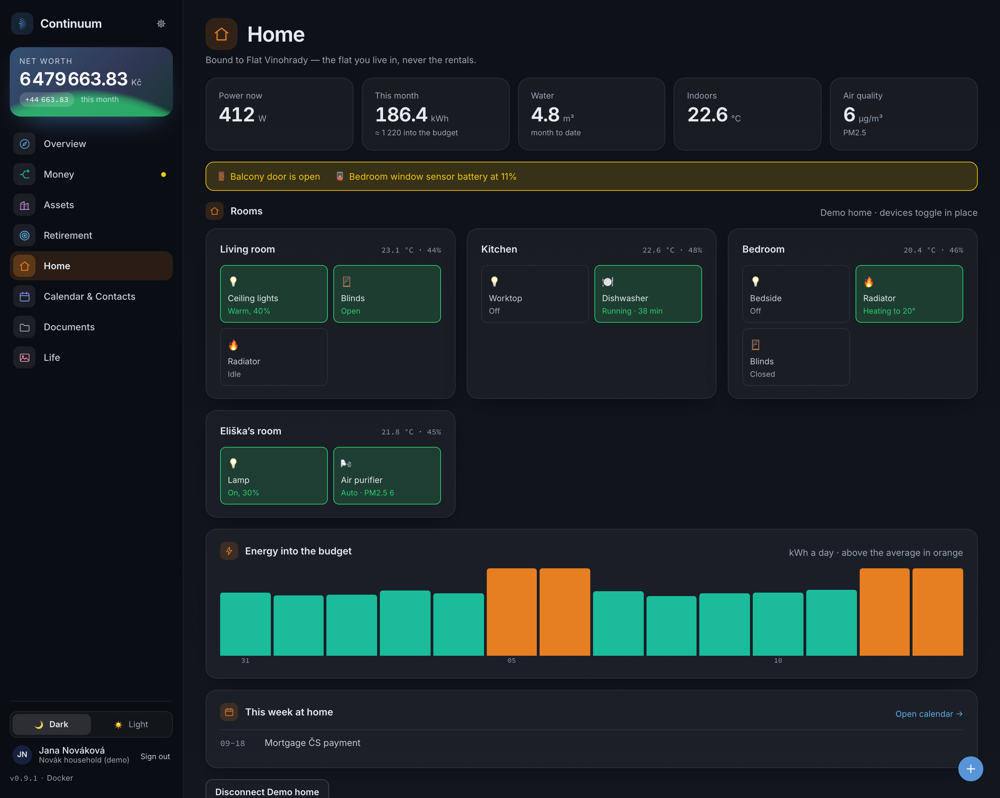
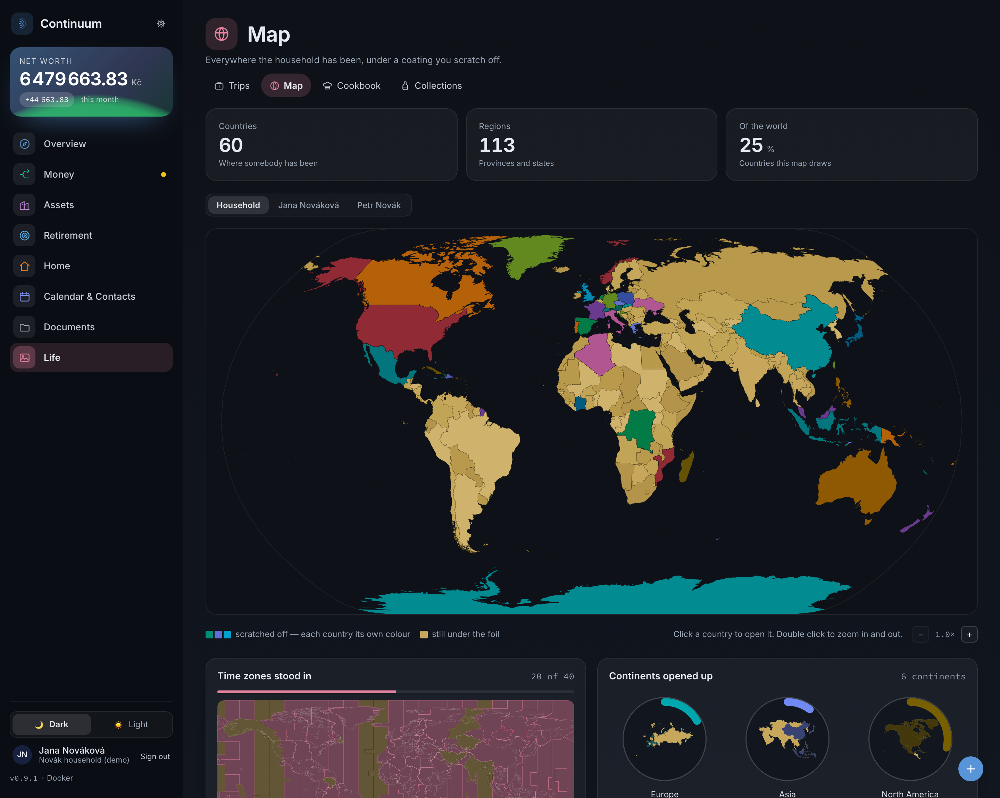

<div align="center">


<h1>Continuum</h1>

<h3>One ledger for the whole household — the money, the paper, the dates and the house itself.<br>One server, one app, any device you own.</h3>

<p>
  <a href="#what-it-holds"><b>What it holds</b></a> &nbsp;·&nbsp;
  <a href="#screens"><b>Screens</b></a> &nbsp;·&nbsp;
  <a href="#it-reads-any-banks-statement"><b>How import works</b></a> &nbsp;·&nbsp;
  <a href="#install"><b>Install</b></a> &nbsp;·&nbsp;
  <a href="docs/"><b>Docs</b></a> &nbsp;·&nbsp;
  <a href="CHANGELOG.md"><b>Changelog</b></a>
</p>

<p>
  <a href="https://hub.docker.com/r/kerth92/continuum"></a>
  
  
  <a href="LICENSE"></a>
</p>

<picture>
  <source media="(prefers-color-scheme: dark)" srcset="docs/screenshots/overview-dark-web.png">
  <source media="(prefers-color-scheme: light)" srcset="docs/screenshots/overview-light-web.png">
  
</picture>

</div>

<br>

## Why this exists

Running a household means running a dozen small systems that do not talk to each other. The bank's app knows the money and nothing else. The insurer's portal knows one policy. The photos of documents sit in a phone. The boiler service date is in somebody's head, the smart-home app is a separate icon, and the spreadsheet that was supposed to hold it together is three months out of date.

Continuum is one ledger for the lot, running on one machine in your house.

It starts with the money, because the money touches everything — and because bank exports are the hardest part. It reads the files your bank already gives you, whichever bank wrote them, works out their structure from the files themselves, and checks what it extracted against the statement's own balances. It never connects to your bank; it works from the files you already have.

From there it connects the money to what belongs around it: the flat, the mortgage secured against it, the tenants, the portfolio, the payslips and the taxes all of that generates. Then to the paper that proves it — photographed with a phone, read in the background, filed against the record it belongs to. Then to the dates that fall out of both, in one calendar. Then to the house itself: the lights, the radiators, the meter, with the electricity reading landing on the flat's own bill.

And it does all of it for the household rather than for one person. Each person keeps their own sign-in, their own board and their own tax position; the household shares one underlying ledger. One view of what came in, where it went, what belongs to whom, what has to be done and what the house is doing right now.

Nothing leaves the machine. No cloud account, no subscription, no telemetry, no trackers.

## Is this for you?

Continuum is for you if you…

- 📊 **are tired of the spreadsheet** — and of losing an evening every month keeping it up to date
- 🧩 **have too much to keep track of** — accounts, bills, property, loans, investments, tax, paper, renewals, the boiler service, all in different places
- 🏠 **want one app for the household** — money, documents, calendar and the smart home behind a single sign-in, on a single screen, rather than eight apps and a shared note
- 🚀 **want setup to be painless** — one Compose file, one command, then a guided setup; nothing to edit by hand
- ⚡ **want it to just work** — give Continuum the file exactly as your bank provided it and let it work out the rest; if something is genuinely ambiguous, it asks
- 📅 **need to know what is due and when** — documents stay attached to the property, loan or person they belong to, while every important date comes together in one calendar
- 📱 **reach it from whatever is to hand** — the same instance from a laptop, a tablet or a phone on the sofa, with no app to install
- 🔒 **want what is private to stay at home** — your records, your paper and your meter readings remain on your own machine
- 💸 **are done with subscriptions** — no monthly fee, no cloud account, no service you have to keep paying for
- 🌍 **live across currencies or countries** — income, assets, accounts and taxes can span more than one of each

## What it holds

One server on your network holds all of it, and every screen is the same ledger seen from a different side.

|                          |                                                                                                                                                                           |
| ------------------------ | ------------------------------------------------------------------------------------------------------------------------------------------------------------------------- |
| 💰 **Money**             | Accounts in their own currencies, a register of months, cash flow as a Sankey, rules that file what repeats, and tags that group a project across accounts                |
| 🏢 **Assets**            | Flats with drawable floor plans, tenancies and bills; mortgages with fixation periods and what-if repayments; a portfolio fed by broker reports                           |
| 🧾 **Earning and owing** | Payslips read into monthly salary figures, yearly tax statements per person and country, and a retirement projection built on the rest                                    |
| 🗂️ **Paper**             | Photograph a page and get a cropped, flattened PDF; it is read in the background, searchable by what is printed inside it, and filed on shelves you name                  |
| 📅 **Time**              | Renewals, expiries, due dates and tenancy ends become one calendar, with an ics feed and two-way sync to Google, iCloud or CalDAV                                         |
| 🏠 **The house**         | Rooms, lights, blinds, radiators and sensors through Home Assistant — switched from the same screen, with the month's kWh landing on the lived-in flat's electricity bill |
| ✈️ **Life**              | Trips with bookings and passport readiness, a world map that fills itself in as trips end, a cookbook that scales to the number eating, and shelves for what you collect  |

Every row is a module. Switch off what you do not want and it leaves the navigation with it.

## Screens

<div align="center">
<table>
<tr>
<td width="50%" align="center">
  <picture>
    <source media="(prefers-color-scheme: dark)" srcset="docs/screenshots/cashflow-dark-web.png">
    <source media="(prefers-color-scheme: light)" srcset="docs/screenshots/cashflow-light-web.png">
    
  </picture>
  <br><b>Cash flow</b><br><sub>Where it came from and where it went</sub>
</td>
<td width="50%" align="center">
  <picture>
    <source media="(prefers-color-scheme: dark)" srcset="docs/screenshots/transactions-dark-web.png">
    <source media="(prefers-color-scheme: light)" srcset="docs/screenshots/transactions-light-web.png">
    
  </picture>
  <br><b>Transactions</b><br><sub>Open a month, then a row — file, split, tag</sub>
</td>
</tr>
<tr>
<td width="50%" align="center">
  <picture>
    <source media="(prefers-color-scheme: dark)" srcset="docs/screenshots/home-dark-web.png">
    <source media="(prefers-color-scheme: light)" srcset="docs/screenshots/home-light-web.png">
    
  </picture>
  <br><b>Home</b><br><sub>Rooms and devices, and the meter on the bill</sub>
</td>
<td width="50%" align="center">
  <picture>
    <source media="(prefers-color-scheme: dark)" srcset="docs/screenshots/documents-dark-web.png">
    <source media="(prefers-color-scheme: light)" srcset="docs/screenshots/documents-light-web.png">
    
  </picture>
  <br><b>Documents</b><br><sub>Photographed, read, filed against the record</sub>
</td>
</tr>
<tr>
<td width="50%" align="center">
  <picture>
    <source media="(prefers-color-scheme: dark)" srcset="docs/screenshots/property-dark-web.png">
    <source media="(prefers-color-scheme: light)" srcset="docs/screenshots/property-light-web.png">
    
  </picture>
  <br><b>Property</b><br><sub>Tenancies, drawable floor plans, bills</sub>
</td>
<td width="50%" align="center">
  <picture>
    <source media="(prefers-color-scheme: dark)" srcset="docs/screenshots/map-dark-web.png">
    <source media="(prefers-color-scheme: light)" srcset="docs/screenshots/map-light-web.png">
    
  </picture>
  <br><b>Map</b><br><sub>Where the household has been, filled in by its trips</sub>
</td>
</tr>
</table>

<sub>Overview, accounts, import, rules, tags, loans, investments, salary, tax,
retirement, calendar, contacts, trips, the cookbook, the cellar and the phone
layouts are in the <a href="docs/screenshots.md">full gallery</a>. Every shot is generated from
the demo household rather than drawn by hand, so what you see is the app.</sub>

</div>

## It reads any bank's statement

Upload what your bank actually gives you:

| What you upload                   | How it is read                                |
| --------------------------------- | --------------------------------------------- |
| CSV, TSV, or any delimited export | encoding, delimiter and columns worked out    |
| Excel workbook (`.xlsx`)          | a statement per sheet                         |
| PDF                               | the table recovered from the page geometry    |
| CAMT.053, MT940, ABO/GPC, OFX/QFX | read directly — these declare their own shape |
| A photo or scan of a printout     | read from the page image, in the background   |

**Measured, not asserted.** Across a 294-file synthetic corpus spanning 24 locales
and 20 currencies, 274 of the 294 are read exactly, and
`tests/acceptance/synthetic-corpus.test.ts` holds that in CI in both directions. The
real statements — ten institutions in four countries — are read without knowing which
bank wrote them; that one was measured by hand rather than by a suite, because the
files cannot be committed.

It earns that by refusing. A statement is filed only once it agrees with its own
arithmetic — the printed opening and closing balances, the running balance, the
stated totals, the movement count. A file that prints none of those cannot be
checked by anyone, so it is refused rather than trusted; so is a genuinely
ambiguous one, like a date column where every reading is valid. Scanned pages are
the newest path and the least reliable, and are held to the same proof.

When a layout is new, it asks instead of guessing: you name the date column and
the amount column once, and the next statement from that bank arrives already
understood.

→ [How the reader works, and every file it still cannot read with the reason for
each](docs/statement-import.md)

## One server, one app, any device

There is one instance, on one machine in your house. Everything else is a
browser pointed at it — a laptop at the kitchen table, a tablet on the shelf, a
phone on the sofa. Nothing to install on any of them, no app store, no second
account, no sync: every device is looking at the same ledger at the same moment,
so a bill marked paid from a phone is paid on the laptop before it is put down.

- **Keeps one picture** — accounts, property, loans, investments, tax, documents, calendar and the house share a single ledger, so the relationships between them stay visible rather than living in eight apps that each know a fifth of the story.
- **Never calls home** — no cloud account, no subscription, no telemetry, no trackers. Your statements, your paper and your meter readings never leave the machine.
- **Reaches the house, and records what it finds** — lights, blinds, radiators and sensors are switched from the same screen as everything else, through Home Assistant; the month's kWh lands on the lived-in flat's electricity bill rather than in a second app nobody reconciles.
- **Is safe to re-run** — re-import overlapping exports as often as you like; duplicates are impossible. Backfilling years of history is the intended use.
- **Is exact about money** — integer minor units end to end, never floats, and multi-currency totals use the rate from the day.
- **Fits a household, not an account holder** — separate sign-ins, boards and tax statements over one shared ledger, with read-only tokens for anything else on the network that wants to ask.
- **Scans paper with a phone** — photograph a page and get a cropped, flattened, black-and-white PDF; several pages become one document. The processing runs on your own server rather than on the phone, so an old handset scans as well as a new one, and the photographs are deleted as soon as the document is saved.
- **Finds a document by what is printed inside it** — filed paper is read in the background, so a variable symbol on page two of a scan is searchable, and the shelves it is filed on are yours to name.
- **Keeps the paper beside the record it belongs to** — a flat, a tenancy, a loan, an account, a contact, a transaction, a tax statement and the portfolio each show their own documents on their own screen; most of them can also attach paper already filed elsewhere, and a flat, a tenancy, a loan and a contact can add a new document with the record and its shelf already chosen.
- **Is only as big as you need** — every area is a module. Run it as a ledger and nothing else, or switch on the house, the trips and the cookbook; what is off leaves the navigation with it.

## Install

Two commands, and nothing to sign up for. You need Docker on a machine that
stays on — a Raspberry Pi, a mini PC, a NAS.

```sh
docker run --rm kerth92/continuum compose > compose.yaml
docker compose up -d
```

The first line writes the Compose file out of the image; the second starts the
app, its database and a small announcer that gives the machine a name on your
network. Then open **`http://continuum.local`** from any phone, tablet or
laptop in the house and follow the setup wizard. People, base currency and
modules are all set there; nothing is edited in files.

The same second line, run again later, updates everything to the newest
release.

**Want to look around first?** Start with `DEMO=1 docker compose up -d` and
the instance comes up with a fictional household — six months of cash flow,
two flats on one mortgage, payslips, a portfolio, filed paper, trips, and a
smart home whose lights actually switch, all without hardware. Sign in as
**Jana Nováková** / `demo-demo-demo`. An instance that already has people is
never touched.

**Scanning paper.** The scan button on a phone opens the camera app; the photo
comes back cropped, flattened and saved as a PDF, and "Add a page" takes the
next one. Several pages become one document.

**What it needs.** About 300 MB of memory for the app and its database, from a
393 MB image built for `amd64` and `arm64`. A Raspberry Pi 4 or 5 with 2 GB on
a 64-bit OS runs it comfortably; there is no 32-bit build.

> [!IMPORTANT]
> This holds your household's complete record — the money, the paper, the
> dates — in plain text in a database, and with the house connected it can
> switch devices in it. All of that is reachable by anyone on your home network
> who has a password. Run it on a network you trust, never on a public-facing
> host, and keep backups — Settings → Backups writes a restorable dump plus
> every uploaded file to a folder you choose, including a cloud-synced one.

→ [Install and configuration](docs/install.md) · [Reaching it on your
network](docs/networking.md) · [Backups and restore](docs/backups.md)

## Documentation

|                                                   |                                                                 |
| ------------------------------------------------- | --------------------------------------------------------------- |
| [Statement import](docs/statement-import.md)      | how the reader works, and what it refuses                       |
| [Documents](docs/documents.md)                    | shelves, subjects, types, expiry, search inside files, scanning |
| [Install and configuration](docs/install.md)      | quick start, updating, every setting                            |
| [Reaching it on your network](docs/networking.md) | the name, the router, Android, your own proxy                   |
| [Accounts and roles](docs/accounts.md)            | enrollment links, administrators, recovery                      |
| [Backups and restore](docs/backups.md)            | scheduled dumps, restoring into a fresh instance                |
| [API and Home Assistant](docs/api.md)             | read-only tokens, smart-meter billing                           |
| [Calendar sync](docs/google-calendar-setup.md)    | connecting Google, iCloud or CalDAV                             |
| [Screenshot gallery](docs/screenshots.md)         | every screen, both themes, desktop and phone                    |
| [Architecture](ARCHITECTURE.md)                   | how the codebase is laid out                                    |

## Contributing

Bug reports, new bank formats and patches are welcome. Local setup is three
commands:

```sh
docker compose up -d db && npm install && npm run dev
```

[CONTRIBUTING.md](CONTRIBUTING.md) covers the rest, including the one rule with
no exceptions: no real financial data ever leaves your machine — committed
fixtures are synthetic and anonymised, and stay that way. Participation is under
the [Code of Conduct](CODE_OF_CONDUCT.md).

Found a security problem? Do not open an issue —
[SECURITY.md](SECURITY.md) explains how to report it privately.

## License

[GNU Affero General Public License v3.0 or later](LICENSE) — free to run, study,
modify and share, for any purpose. Copyright © 2026 Robert Kiewisz.

The one condition: if you modify Continuum and let other people use your version
— whether you hand them the files or they reach it over a network — you owe them
the source of your version under the same licence. Running it at home, changing
it for yourself and sending patches back all sit comfortably inside that.

Contributions are accepted under a [Contributor Licence Agreement](CLA.md): you
keep the copyright in what you write, and grant permission to license it onward,
including under terms other than the AGPL. A commercial licence, for
organisations that cannot accept copyleft terms, is available on request.
