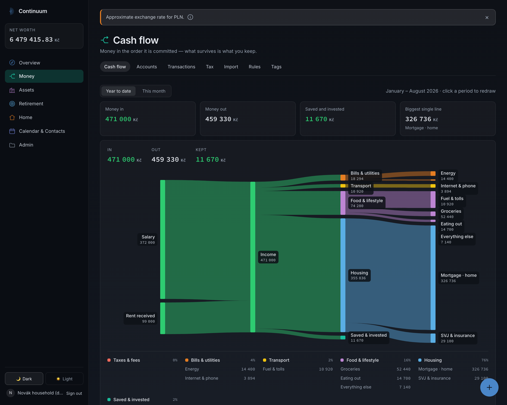
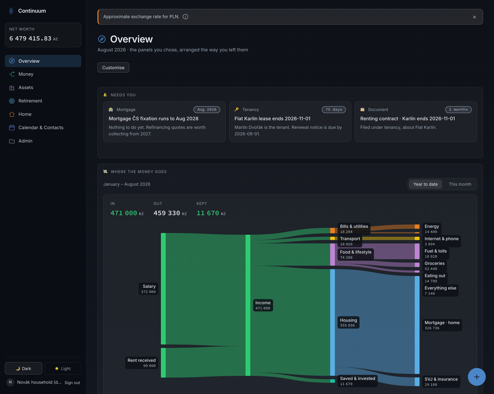
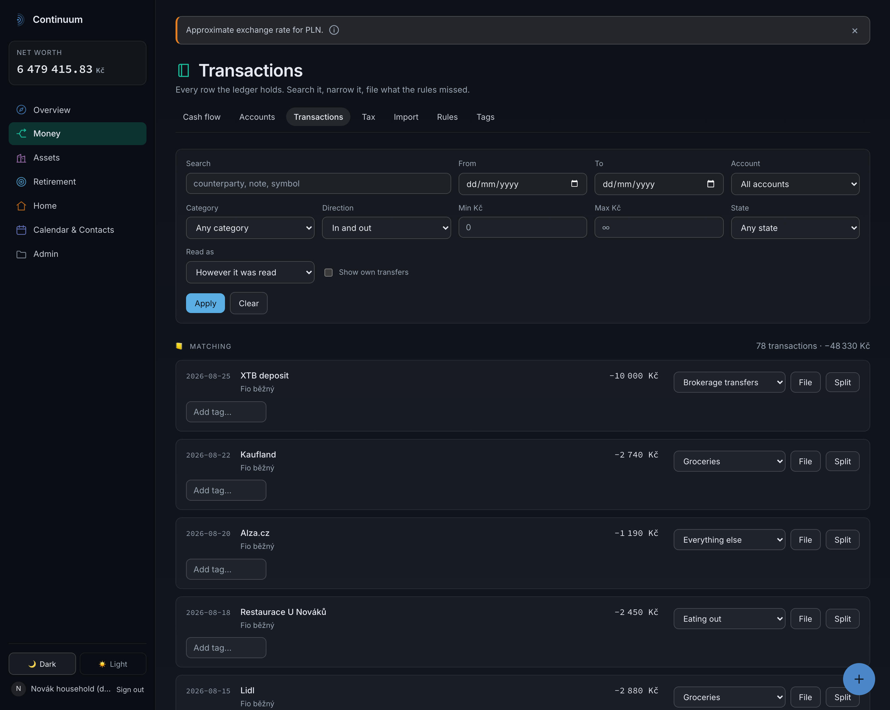
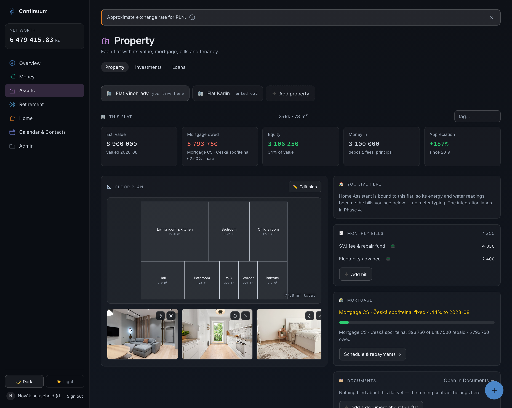
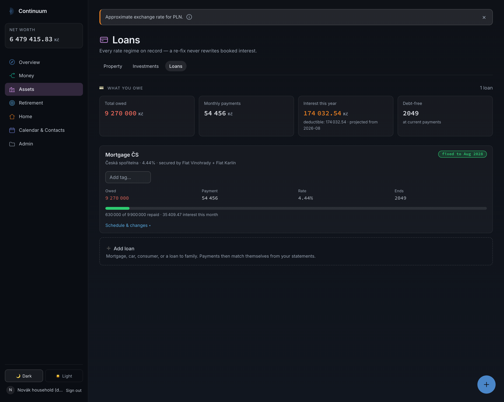
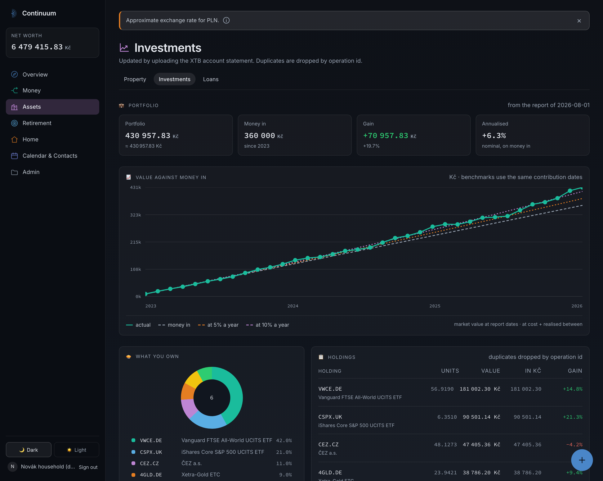
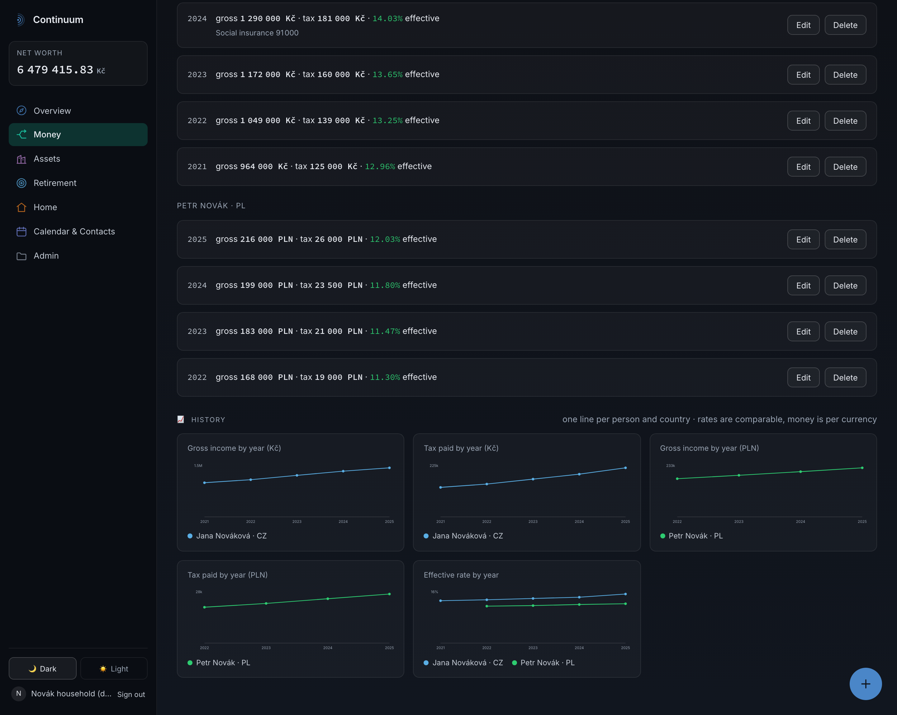

<div align="center">


<h1>Continuum</h1>

<h3>Your household's whole financial picture, on hardware you own.</h3>

<p>
  <a href="#screens"><b>Screens</b></a> &nbsp;·&nbsp;
  <a href="#it-reads-any-banks-statement"><b>How import works</b></a> &nbsp;·&nbsp;
  <a href="#try-it-in-one-command"><b>Quickstart</b></a> &nbsp;·&nbsp;
  <a href="docs/"><b>Docs</b></a> &nbsp;·&nbsp;
  <a href="CHANGELOG.md"><b>Changelog</b></a>
</p>

<p>
  <a href="https://hub.docker.com/r/kerth92/continuum"></a>
  
  
  
  <a href="LICENSE.md"></a>
</p>

<picture>
  <source media="(prefers-color-scheme: dark)" srcset="docs/screenshots/cashflow-dark-web.png">
  <source media="(prefers-color-scheme: light)" srcset="docs/screenshots/cashflow-light-web.png">
  
</picture>

</div>

<br>

## Why this exists

Household finance software tends to assume a simple world: one country, one currency, one bank, and one person. Real households are rarely that tidy. Property may be jointly owned while income is earned separately. Salaries, mortgages, investments, and taxes may span several countries and currencies. And the bank exports that contain the actual records often come in formats that no finance tool properly understands.

Most personal-finance apps start by asking which bank you use. Continuum never does.

Instead, it reads the files your bank already gives you — regardless of the bank — determines their structure from the files themselves, and verifies what it extracted against the statement's own balances.

From there, it connects the money to everything that belongs around it: the property, the mortgage secured against it, the tenants, the investment portfolio, the payslips, and the taxes generated by all of them.

And it does this for the household as a whole, not just for one person. Each person keeps their own sign-in, dashboard, and tax position, while the household shares a single underlying ledger. One view of what came in, where it went, what belongs to whom, and what remains.

Continuum makes a different trade from conventional finance apps. It never connects directly to your bank. It works from the files your bank already provides, on a machine you control.

## Is this for you?

Continuum is for you if you…

- 📊  **are tired of the spreadsheet** — and of losing an evening every month keeping it up to date
- 🧩 **have too much to keep track of** — accounts, bills, property, loans, investments and tax, all scattered across different places
- 🚀 **want setup to be painless** — one Compose file, one command, then a guided setup; no configuration files to edit by hand
- ⚡ **want it to just work** — give Continuum the file exactly as your bank provided it and let it work out the rest; if something is genuinely ambiguous, it asks
- 🏠 **want the whole household in one view** — what comes in, where it goes, who it belongs to, and what is left
- 📅 **need to know what is due and when** — documents stay attached to the property, loan or person they belong to, while every important date comes together in one calendar
- 🔒 **want sensitive data to stay at home** — your financial records remain on your own machine
- 💸 **are done with subscriptions** — no monthly fee, no cloud account, no service you have to keep paying for
- 🌍 **live across currencies or countries** — income, assets, accounts and taxes can span more than one of each

## Screens

<div align="center">
<table>
<tr>
<td width="50%" align="center">
  <picture>
    <source media="(prefers-color-scheme: dark)" srcset="docs/screenshots/overview-dark-web.png">
    <source media="(prefers-color-scheme: light)" srcset="docs/screenshots/overview-light-web.png">
    
  </picture>
  <br><b>Overview</b><br><sub>A board each person arranges for themselves</sub>
</td>
<td width="50%" align="center">
  <picture>
    <source media="(prefers-color-scheme: dark)" srcset="docs/screenshots/transactions-dark-web.png">
    <source media="(prefers-color-scheme: light)" srcset="docs/screenshots/transactions-light-web.png">
    
  </picture>
  <br><b>Transactions</b><br><sub>Search, split a receipt, tag into projects</sub>
</td>
</tr>
<tr>
<td width="50%" align="center">
  <picture>
    <source media="(prefers-color-scheme: dark)" srcset="docs/screenshots/property-dark-web.png">
    <source media="(prefers-color-scheme: light)" srcset="docs/screenshots/property-light-web.png">
    
  </picture>
  <br><b>Property</b><br><sub>Tenancies, drawable floor plans, bills</sub>
</td>
<td width="50%" align="center">
  <picture>
    <source media="(prefers-color-scheme: dark)" srcset="docs/screenshots/loans-dark-web.png">
    <source media="(prefers-color-scheme: light)" srcset="docs/screenshots/loans-light-web.png">
    
  </picture>
  <br><b>Loans</b><br><sub>Fixation periods, what-if repayment previews</sub>
</td>
</tr>
<tr>
<td width="50%" align="center">
  <picture>
    <source media="(prefers-color-scheme: dark)" srcset="docs/screenshots/investments-dark-web.png">
    <source media="(prefers-color-scheme: light)" srcset="docs/screenshots/investments-light-web.png">
    
  </picture>
  <br><b>Investments</b><br><sub>Portfolio fed by broker report uploads</sub>
</td>
<td width="50%" align="center">
  <picture>
    <source media="(prefers-color-scheme: dark)" srcset="docs/screenshots/tax-dark-web.png">
    <source media="(prefers-color-scheme: light)" srcset="docs/screenshots/tax-light-web.png">
    
  </picture>
  <br><b>Tax</b><br><sub>Yearly, per person and country, from payslips</sub>
</td>
</tr>
</table>

<sub>Retirement, calendar, contacts, documents and the phone layouts are in the
<a href="docs/screenshots.md">full gallery</a>. Every shot is generated from the
demo household, so none of them can drift from the app.</sub>

</div>

## It reads any bank's statement

Upload what your bank actually gives you:

| What you upload                   | How it is read                                |
| --------------------------------- | --------------------------------------------- |
| CSV, TSV, or any delimited export | encoding, delimiter and columns worked out    |
| Excel workbook (`.xlsx`)          | a statement per sheet                         |
| PDF                               | the table recovered from the page geometry    |
| CAMT.053, MT940, ABO/GPC, OFX/QFX | read directly — these declare their own shape |
| A photo or scan of a printout     | read from the page image, in the background   |

**Measured, not asserted.** Across a 294-file corpus spanning 24 locales and 20
currencies, plus real statements from ten institutions in four countries: every
real statement is read without knowing which bank wrote it, and 274 of the 294
are read exactly.

It earns that by refusing. A statement is filed only once it agrees with its own
arithmetic — the printed opening and closing balances, the running balance, the
stated totals, the movement count. A file that prints none of those cannot be
checked by anyone, so it is refused rather than trusted; so is a genuinely
ambiguous one, like a date column where every reading is valid. Scanned pages are
the newest path and the least reliable, and are held to the same proof.

When a layout is new, it asks instead of guessing: you name the date column and
the amount column once, and the next statement from that bank arrives already
understood.

→ [How the reader works, and every file it still cannot read with the reason for
each](docs/statement-import.md)

## And everything attached to it

- **Keeps one picture** — accounts, property, loans, investments, tax, documents and calendar share a single ledger, so the relationships between them stay visible.
- **Never calls home** — no cloud account, no subscription, no telemetry, no trackers. Your statements never leave the machine.
- **Is safe to re-run** — re-import overlapping exports as often as you like; duplicates are impossible. Backfilling years of history is the intended use.
- **Is exact about money** — integer minor units end to end, never floats, and multi-currency totals use the rate from the day.
- **Fits two people** — separate sign-ins, passkeys, dashboards and tax statements over one shared household.

## Try it in one command

```sh
curl -O https://raw.githubusercontent.com/pandorica-scientific/continuum/main/compose.yaml
DEMO=1 docker compose up -d
```

Open `http://localhost` and sign in as **Jana Nováková** / `demo-demo-demo`. That
seeds a fictional household — six months of categorised cash flow, two flats on
one mortgage, payslips, a portfolio — so you can look around before importing
anything real. An instance that already has people in it is never touched.

For a real instance, drop `DEMO=1`, set a database password, and follow the setup
wizard:

```sh
POSTGRES_PASSWORD=change-me docker compose up -d
```

**What it needs.** About 300 MB of memory at rest — measured at 191 MB for the
app and 69 MB for Postgres — from a 393 MB image built for both `amd64` and
`arm64`. A Raspberry Pi 4 or 5 with 2 GB on a 64-bit OS runs it comfortably.
There is no 32-bit build, so a Pi 3 or older will not.

Docker and Docker Compose are the supported route today. Podman, Proxmox,
TrueNAS, Umbrel and Unraid packaging are planned.

> [!IMPORTANT]
> This holds your household's complete financial history in plain text in a
> database. Run it on a machine you trust, on your own network — never on a
> public-facing host — and keep backups. Settings → Backups writes a restorable
> dump plus every uploaded file to a folder you choose, including a cloud-synced
> one.

→ [Install, configuration and upgrading](docs/install.md) · [Backups and
restore](docs/backups.md)

## Documentation

|                                               |                                                  |
| --------------------------------------------- | ------------------------------------------------ |
| [Statement import](docs/statement-import.md)  | how the reader works, and what it refuses        |
| [Install and configuration](docs/install.md)  | `.env` reference, ports, upgrading               |
| [Networking and passkeys](docs/networking.md) | reaching it by name, HTTPS via Tailscale         |
| [Accounts and roles](docs/accounts.md)        | enrollment links, administrators, recovery       |
| [Backups and restore](docs/backups.md)        | scheduled dumps, restoring into a fresh instance |
| [API and Home Assistant](docs/api.md)         | read-only tokens, smart-meter billing            |
| [Screenshot gallery](docs/screenshots.md)     | every screen, both themes, desktop and phone     |
| [Architecture](ARCHITECTURE.md)               | how the codebase is laid out                     |

## Contributing

Bug reports, new bank formats and patches are welcome. Local setup is three
commands:

```sh
docker compose up -d db && npm install && npm run dev
```

[CONTRIBUTING.md](CONTRIBUTING.md) covers the rest, including the one rule with
no exceptions: no real financial data ever leaves your machine — committed
fixtures are synthetic and anonymised, and stay that way. Participation is under
the [Code of Conduct](CODE_OF_CONDUCT.md).

Found a security problem? Do not open an issue —
[SECURITY.md](SECURITY.md) explains how to report it privately.

## License

[PolyForm Noncommercial](LICENSE.md) — free to self-host and modify for personal,
noncommercial use.
