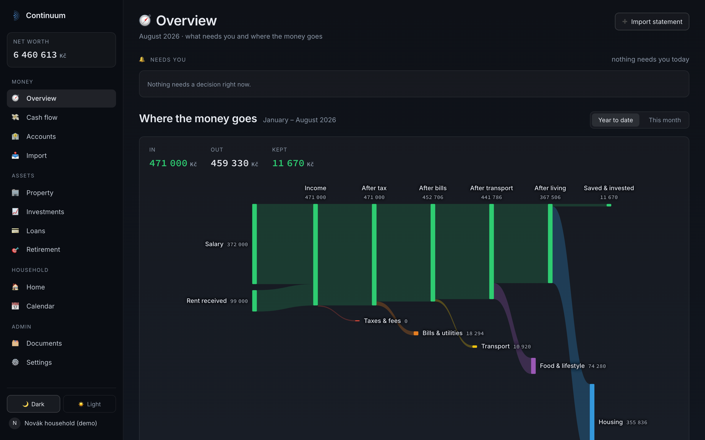
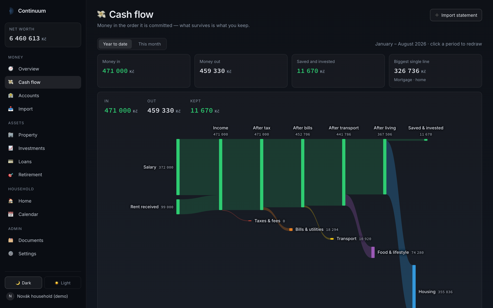
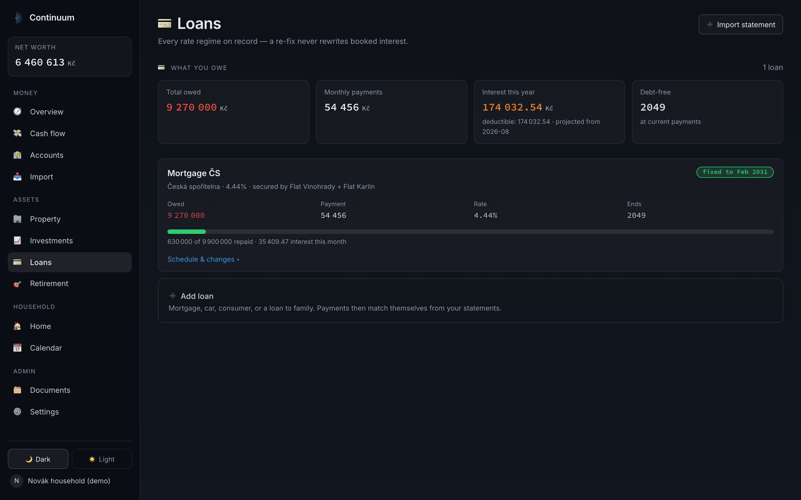
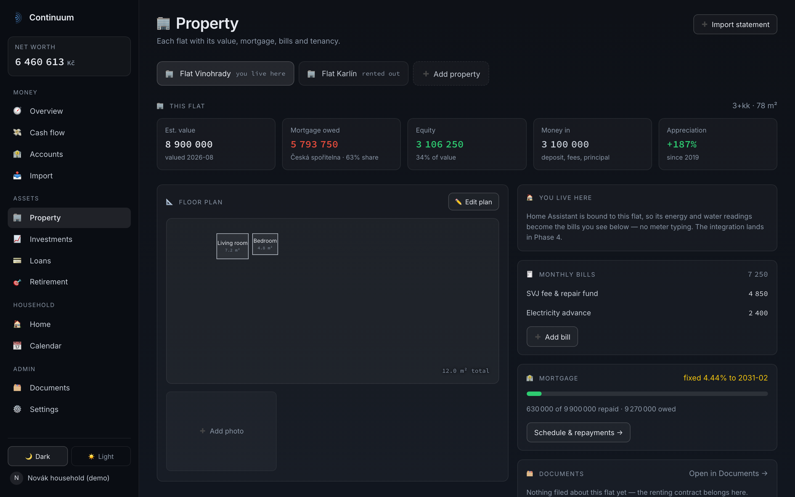

# Continuum

A self-hosted household finance server. Import bank statements, watch where the
money goes, and keep everything — accounts, property, loans, investments,
documents — in one place on your own hardware. Nothing calls home.

Continuum is built for households, not companies: two people, a few banks in a
few currencies, a flat or two, and the question that actually matters — _what
is our net worth right now, and is it going up?_



## Status

All five phases are functional: setup wizard and per-person sign-in; statement
import for five banks with automatic categorisation and transfer pairing
across your own accounts; a searchable transaction register where a receipt
can be split between categories and anything can be tagged into projects with
running totals; a rules engine whose rules earn (and lose) trust from whether
their suggestions survive your corrections; the cash-flow waterfall;
multi-currency accounts with daily CNB rates; property with tenancies,
drawable floor plans and bills with attached documents; loans with
fixation-period interest bookkeeping and what-if repayment/re-fix previews;
investments fed by broker report uploads (XTB first, behind an adapter seam);
retirement projection with a payslip-fed salary tracker; yearly tax statements
per person and country, pre-filled from the payslips and charted over time;
documents that always belong to something real — a person, a flat, an
investment, the household — so columns follow renames and a typo cannot mint a
phantom subject; a generated calendar with an ics feed; a read-only JSON API
behind bearer tokens for dashboards and Home Assistant; Home Assistant itself
behind a pluggable provider interface; and scheduled backups straight into a
cloud-synced folder.

|                                             |                                      |
| ------------------------------------------- | ------------------------------------ |
|  |  |
|   |                                      |

### Supported statement formats

| Bank             | Format                                                 |
| ---------------- | ------------------------------------------------------ |
| Fio banka        | CSV (Internetbanking export)                           |
| Revolut          | CSV (account statement)                                |
| mBank            | CSV (elektroniczne zestawienie operacji, windows-1250) |
| Raiffeisenbank   | PDF (text layer, no OCR)                               |
| Česká spořitelna | PDF (text layer, no OCR)                               |

Statements are deduplicated by content and by transaction, so re-uploading
overlapping exports is always safe — including concurrent uploads and exports
that overlap an older fingerprint format. Account identity includes bank,
currency and the exact normalised account number; an ambiguous match is held
for a person instead of creating or choosing an account by guess. Re-uploading
is the intended way to backfill years of history.

## Install (Docker)

```sh
curl -O https://raw.githubusercontent.com/pandorica-scientific/continuum/main/compose.yaml
docker login   # the kerth92/continuum image is private for now
POSTGRES_PASSWORD=change-me docker compose up -d
```

Open `http://your-server` (port 80 by default; set `CONTINUUM_PORT` in `.env`
if something else already owns it) and follow the setup wizard. Everything —
people, base currency (CZK, EUR or PLN), modules — is configured there, not in
files.

Three optional knobs live in `.env`. `CONTINUUM_MAX_UPLOAD` sets the largest
accepted upload (`32M` by default — a phone photo does not fit in the server's
own 512 KB default). `ADDRESS_HEADER=x-forwarded-for` makes the app read the
real client address from a forwarded header, which authentication rate limits
need behind a reverse proxy. `XFF_DEPTH=1` chooses the trusted hop counted from
the right of `X-Forwarded-For`; increase it only for a known proxy chain. Set
either only where that chain is the only way in and always overwrites the
header, or a caller can forge its address.

Backups: Settings → Backups writes one restorable database dump
(`continuum-backup.sql`, overwritten on every run) plus a copy of every
uploaded file to a folder of your choosing, weekly or monthly. By default that
is the `continuum-backups` volume; point `CONTINUUM_BACKUPS` (in `.env`) at a
cloud-synced folder on the host — a Google Drive or Dropbox directory — and
the sync client carries the backup off-machine and keeps the dump's version
history on its side:

```sh
# .env
CONTINUUM_BACKUPS=/Users/you/Library/CloudStorage/GoogleDrive-you@gmail.com/My Drive
```

Restoring is booting a fresh instance (its migrations recreate the schema) and
feeding it the dump:

```sh
docker compose exec -T db psql -U continuum -d continuum -v ON_ERROR_STOP=1 \
  < "Continuum backups/continuum-backup.sql"
```

then copying the `files/` folder back into the `continuum-data` volume.

### Upgrading

Take a backup, then pull and restart the containers:

```sh
docker compose pull
docker compose up -d
```

Database migrations run before the app accepts requests. Release-specific data
repairs and any manual considerations are listed at the top of
[CHANGELOG.md](CHANGELOG.md).

Demo mode: `DEMO=1 docker compose up -d` on a pristine instance seeds a
fictional household — six months of categorised cash flow, two flats on one
shared mortgage, payslips, a portfolio — so you can look around before
importing anything real. Sign in as Jana Nováková with `demo-demo-demo`. An
instance that already has people is never touched.

## Reaching it by name

Typing `ip:port` stops working the moment the router hands the server a new
address. Two steps fix it for every device on the network, no cloud involved:

1. **Pin the address.** In the router's DHCP settings, give the server a
   reservation (a fixed lease for its MAC address). This is the actual cure
   for the rotating IP — do it even if you skip step 2.
2. **Name it.** Either set the server machine's hostname to `continuum`, and
   mDNS makes it reachable as **`http://continuum.local`** from macOS, iOS,
   Windows and recent Android with zero configuration — or, if your router
   offers local DNS names, give the reservation a name there (`continuum.lan`
   on most). A Pi-hole or AdGuard Home works too, with a custom DNS record.

The app sits on plain port 80 by default, so the name alone is the whole
address — just tell it what that address is:

```sh
# .env
ORIGIN=http://continuum.local
```

`ORIGIN` must match whatever address you actually browse to — form
submissions are origin-checked and will be refused otherwise. A bare
`continuum` without a suffix is not reliable in browsers (it reads as a
search), so `.local` or your router's suffix is the practical spelling.

## Accounts

The setup wizard makes its first person an **administrator**; everyone added
later is a **member**. Only administrators can add or deactivate people, change
roles, manage API tokens, switch modules on and off, set the base currency, or
configure and run backups. A member's Settings page holds their own password and
their own passkeys and nothing else — the administrative sections are not merely
hidden from them, they are never sent.

Adding someone in Settings → Household produces a **one-time enrollment link**,
valid for seven days, which you pass to them however you like. They open it and
choose their own password — you never see it. Until they do, they show as "not
enrolled yet" and cannot sign in.

Two knobs, both optional, in `.env`: `PASSWORD_MIN_LENGTH` (default 8) and
`ENROLLMENT_LINK_DAYS` (default 7). The password hints in the interface are fed
by the same value the server enforces, so they cannot disagree.

Deactivating a person blocks sign-in and cuts their live sessions, and voids any
enrollment link they never opened — but it keeps their password, passkeys and
all their history, so reactivating is a clean undo.
People are never deleted: accounts, properties, loans, documents and tax
statements reference them.

Two guards mean an instance can never be left without an administrator: you
cannot deactivate yourself, and the last administrator can be neither
deactivated nor demoted. If you somehow lock yourself out, promote someone
directly in the database:

```sh
docker compose exec db psql -U continuum -d continuum \
  -c "UPDATE person SET role = 'admin', deactivated_at = NULL WHERE name = 'Your Name';"
```

## Passkeys and Tailscale

Continuum supports **passkeys** — Face ID, Touch ID, Windows Hello — alongside
passwords. Passwords never go away, so a device without a passkey still works.

Browsers refuse the passkey API outside a secure context, so the passkey
controls appear only when `ORIGIN` is `https://` (or `localhost` during
development). On a plain-HTTP LAN address they are simply absent rather than
broken.

A passkey here always requires **user verification** — the face, the
fingerprint, or the device PIN. That is what keeps it a second factor rather
than a bearer token, and it means a roaming security key with no PIN configured
cannot be registered. Platform authenticators (Face ID, Touch ID, Windows Hello)
verify by nature and need nothing extra.

The simplest way to get HTTPS on a home server is [Tailscale](https://tailscale.com),
a WireGuard mesh that is **private by default**: only devices you have added to
your tailnet can reach the machine. `tailscale serve` publishes to the tailnet;
the command that would expose the app to the public internet is `tailscale
funnel`, which nothing here runs. The one thing that does become public is the
hostname — Tailscale's certificate comes from Let's Encrypt, and every Let's
Encrypt certificate is listed in public Certificate Transparency logs. Nothing
is reachable at that name; only the name is visible.

Generate an auth key in the Tailscale admin console, then:

```sh
# .env
TS_AUTHKEY=tskey-auth-…
ORIGIN=https://continuum.<your-tailnet>.ts.net

docker compose --profile tailscale up -d
```

**Do not remove the LAN port mapping yet.** Sign in over the tailnet address,
register a passkey in Settings → Household, and confirm it signs you in. Only
then delete the `ports:` block from the `app` service in `compose.yaml`, which
makes Tailscale the only way in. Note that this also puts the `/ics` calendar
feed and the `/api` tokens behind the tailnet, so a phone subscribed to the
calendar needs Tailscale connected for it to refresh.

**Already running Tailscale on the host?** Skip the sidecar. Set `ORIGIN` to
your existing `.ts.net` name and run, on the host:

```sh
# 80 is the host port compose publishes by default; use your CONTINUUM_PORT if
# you overrode it. 3000 is the port *inside* the container and is not published.
tailscale serve --bg 80
```

Any other route to a trusted certificate works equally well — a reverse proxy
with Let's Encrypt, or your own internal certificate authority via `mkcert` if
you would rather nothing appear in a public log. Continuum only cares that
`ORIGIN` is `https://` and matches the address you browse to.

## Smart-meter billing

When connecting Home Assistant, choose the lived-in property whose bill the
meter should feed and enter the energy price with its currency. On that
property, mark exactly one bill with the meter control. The hourly sync updates
only that row and converts the price into the property's currency; it never
creates a guessed "energy" bill. If the provider or target changes while a slow
snapshot is in flight, that stale reading is discarded.

## API

Settings → API tokens creates a bearer token (shown once) that grants
read-only access to the whole ledger under `/api/v1` — accounts, transactions
(accepting the register's filter params), categories, tags, net worth and
cash-flow totals. Every amount crosses the wire as integer minor units plus a
currency code, never a float:

```sh
curl -H "Authorization: Bearer <token>" http://your-server/api/v1/networth
# { "total": { "amountMinor": 646055100, "currency": "CZK" }, … }
```

There are no write endpoints and no webhooks — a household produces a handful
of events a week, so a dashboard polls.

## Development

```sh
docker compose up -d db        # Postgres
cp .env.example .env
npm install
npm run dev
```

- `npm test` — unit tests plus isolated embedded-PostgreSQL integration tests
  for imports, authentication, transactions/tags, loans, rollback/concurrency
  and revisioned autosave
- `npm run test:e2e` — Playwright journey (needs the db and `npm run build` first)
- `npm run check` / `npm run lint` — types and style

Real bank statements for parser development belong in
`bank_data_examples_do_not_share/` (gitignored). The committed test fixtures in
`tests/fixtures/` are synthetic and anonymised — keep it that way.

## Contributing

Bug reports, new bank formats and patches are welcome — start with
[CONTRIBUTING.md](CONTRIBUTING.md), which covers the setup above plus the two
rules the codebase follows and the one rule with no exceptions: no real
financial data ever leaves your machine. Participation is under the
[Code of Conduct](CODE_OF_CONDUCT.md).

Found a security problem? Do not open an issue — [SECURITY.md](SECURITY.md)
explains how to report it privately, and what the deployment assumes.

## License

PolyForm Noncommercial — free to self-host and modify for personal,
noncommercial use.
