# Screenshot gallery

Every screenshot here is generated from the demo household by
`scripts/take-screenshots.mjs` against a running `DEMO=1` instance, in both
themes, rather than drawn by hand — so what you see is the app, as of the last
time the script was run. GitHub serves whichever theme you are reading in.

To regenerate them, point the script at a running demo instance:

```sh
DEMO=1 docker compose up -d
node scripts/take-screenshots.mjs
```

## Overview

A board each person arranges for themselves, from thirteen panels.

<picture>
  <source media="(prefers-color-scheme: dark)" srcset="screenshots/overview-dark-web.png">
  <source media="(prefers-color-scheme: light)" srcset="screenshots/overview-light-web.png">
  
</picture>

## Accounts

Balances stay in their own currency. Only totals convert.

<picture>
  <source media="(prefers-color-scheme: dark)" srcset="screenshots/accounts-dark-web.png">
  <source media="(prefers-color-scheme: light)" srcset="screenshots/accounts-light-web.png">
  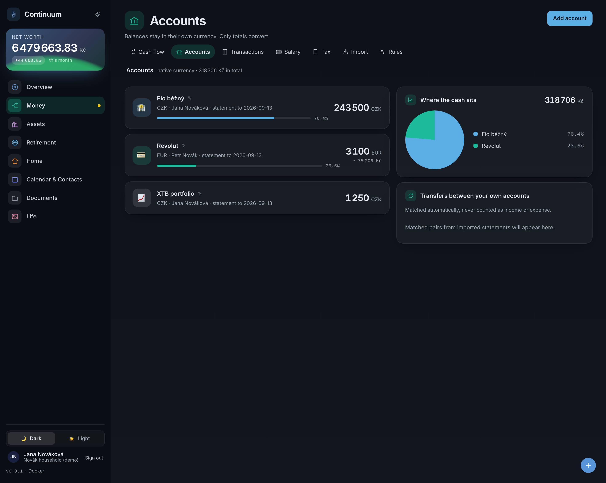
</picture>

## Transactions

A month at a time: what it took in and what it spent, opened into its rows, and
a row opened into everything you can do to it — file it, split a receipt across
categories, tag it into a project, or turn it into a rule.

<picture>
  <source media="(prefers-color-scheme: dark)" srcset="screenshots/transactions-dark-web.png">
  <source media="(prefers-color-scheme: light)" srcset="screenshots/transactions-light-web.png">
  
</picture>

## Import

Statements in, transactions filed. Only the ambiguous ones ask for you.

<picture>
  <source media="(prefers-color-scheme: dark)" srcset="screenshots/import-dark-web.png">
  <source media="(prefers-color-scheme: light)" srcset="screenshots/import-light-web.png">
  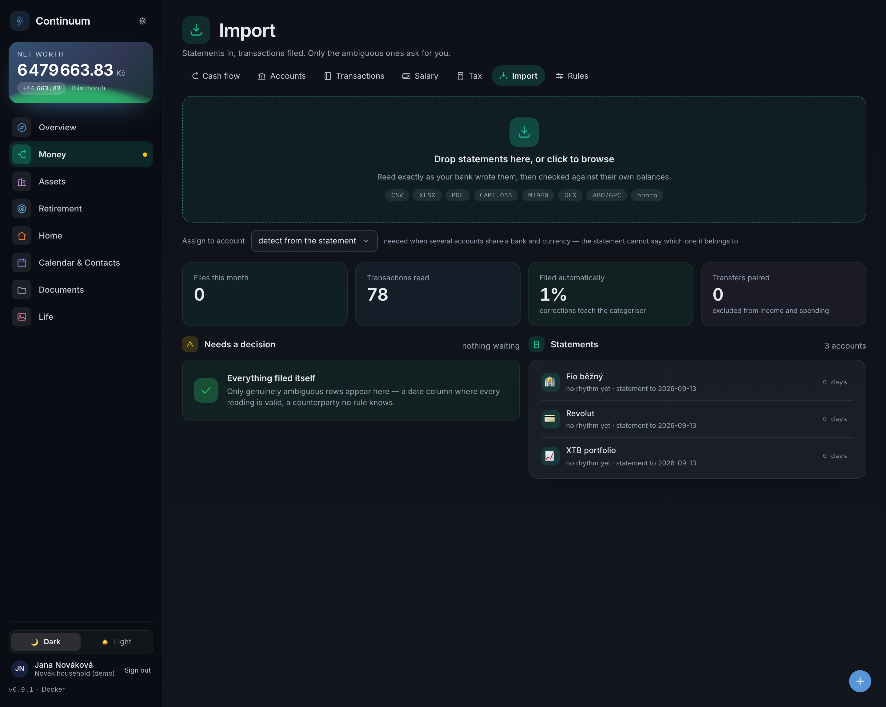
</picture>

## Rules

What files itself, and how much each rule has earned your trust.

<picture>
  <source media="(prefers-color-scheme: dark)" srcset="screenshots/rules-dark-web.png">
  <source media="(prefers-color-scheme: light)" srcset="screenshots/rules-light-web.png">
  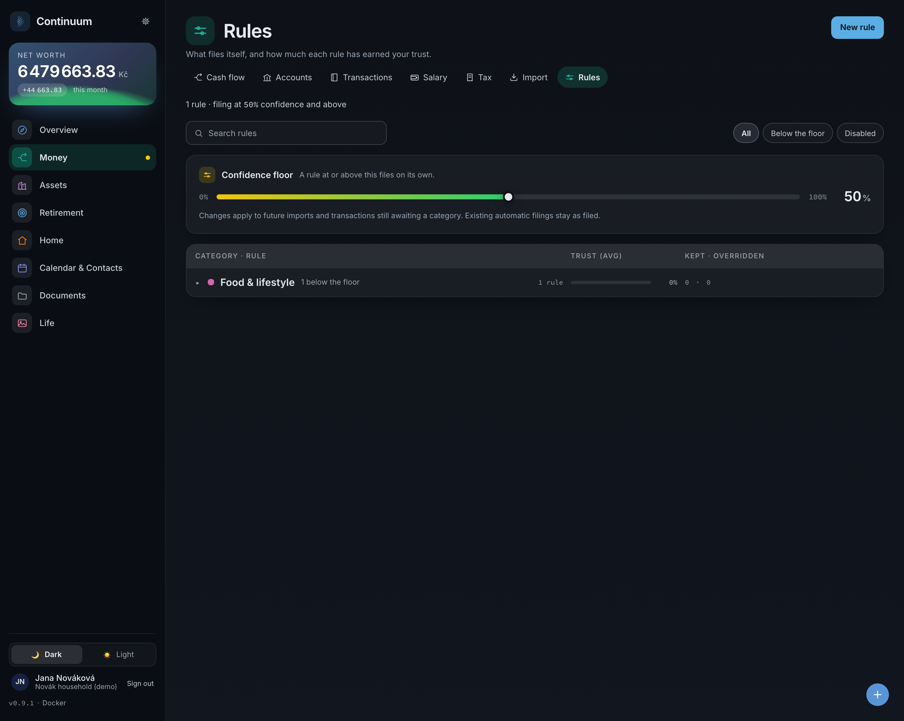
</picture>

## Tags

What each project has cost so far, across every category it touches.

<picture>
  <source media="(prefers-color-scheme: dark)" srcset="screenshots/tags-dark-web.png">
  <source media="(prefers-color-scheme: light)" srcset="screenshots/tags-light-web.png">
  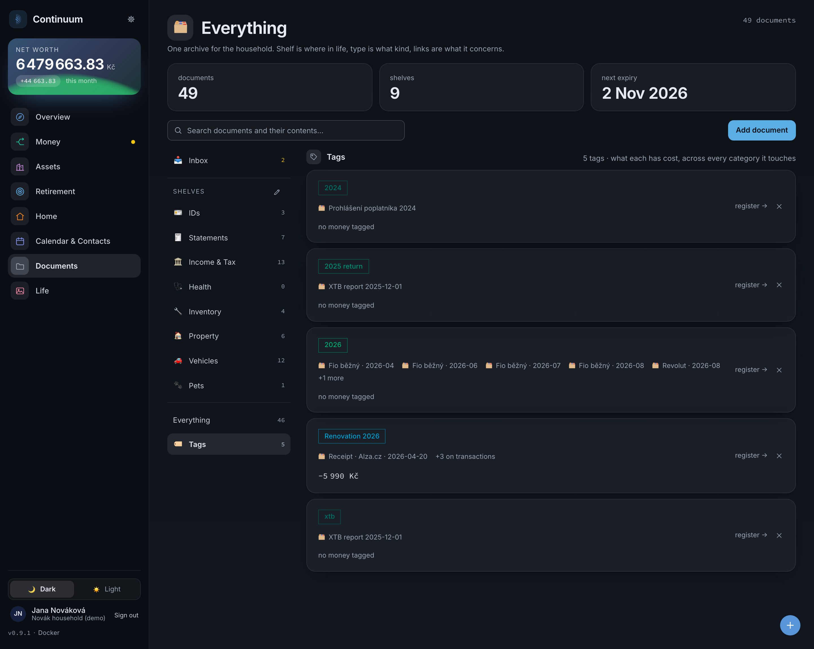
</picture>

## Cash flow

A Sankey in the order money is committed.

<picture>
  <source media="(prefers-color-scheme: dark)" srcset="screenshots/cashflow-dark-web.png">
  <source media="(prefers-color-scheme: light)" srcset="screenshots/cashflow-light-web.png">
  
</picture>

## Property

Tenancies, drawable floor plans, bills with documents attached.

<picture>
  <source media="(prefers-color-scheme: dark)" srcset="screenshots/property-dark-web.png">
  <source media="(prefers-color-scheme: light)" srcset="screenshots/property-light-web.png">
  
</picture>

## Loans

Fixation-period interest, what-if repayment and re-fix previews.

<picture>
  <source media="(prefers-color-scheme: dark)" srcset="screenshots/loans-dark-web.png">
  <source media="(prefers-color-scheme: light)" srcset="screenshots/loans-light-web.png">
  
</picture>

## Investments

Portfolio fed by broker report uploads.

<picture>
  <source media="(prefers-color-scheme: dark)" srcset="screenshots/investments-dark-web.png">
  <source media="(prefers-color-scheme: light)" srcset="screenshots/investments-light-web.png">
  
</picture>

## Salary

What was earned each month, read from payslips and from the ledger.

<picture>
  <source media="(prefers-color-scheme: dark)" srcset="screenshots/salary-dark-web.png">
  <source media="(prefers-color-scheme: light)" srcset="screenshots/salary-light-web.png">
  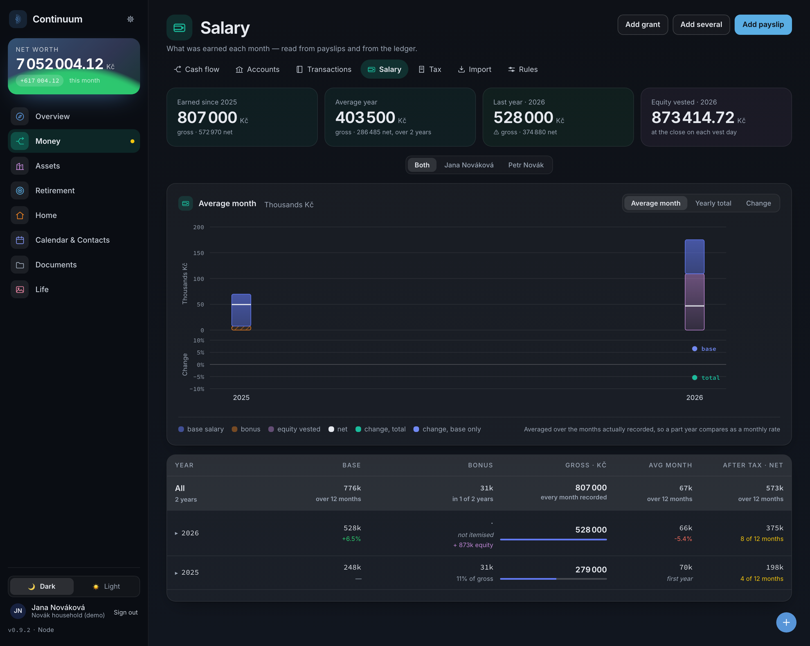
</picture>

## Retirement

The projection model.

<picture>
  <source media="(prefers-color-scheme: dark)" srcset="screenshots/retirement-dark-web.png">
  <source media="(prefers-color-scheme: light)" srcset="screenshots/retirement-light-web.png">
  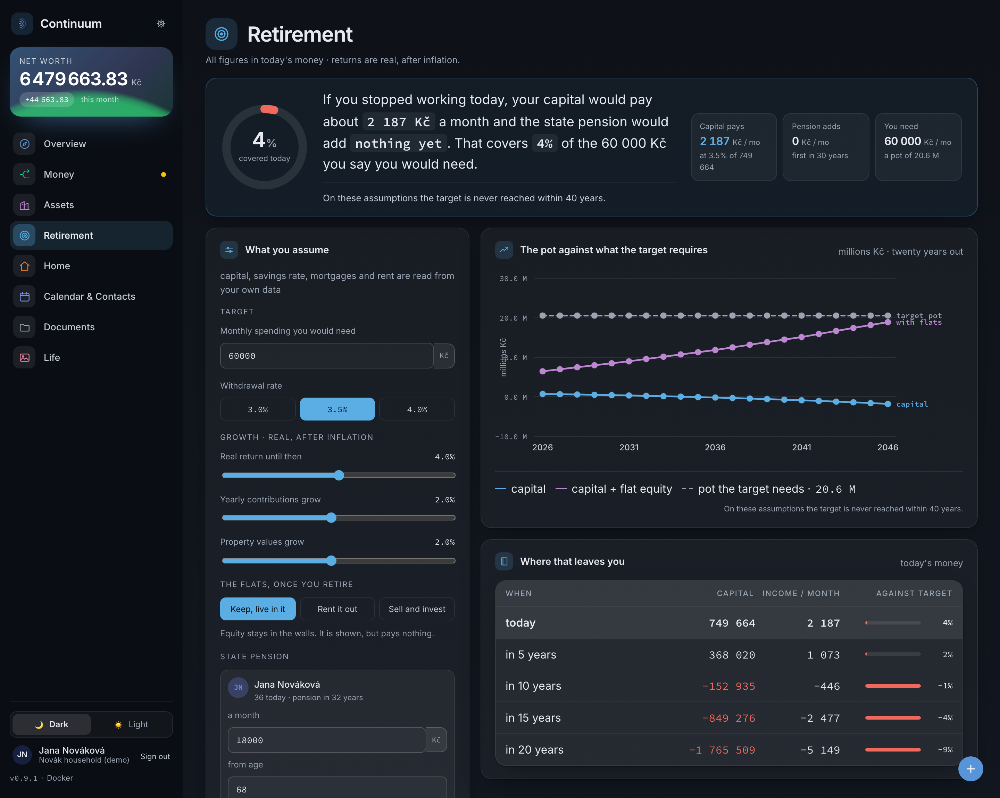
</picture>

## Tax

Yearly statements per person and country, pre-filled from payslips.

<picture>
  <source media="(prefers-color-scheme: dark)" srcset="screenshots/tax-dark-web.png">
  <source media="(prefers-color-scheme: light)" srcset="screenshots/tax-light-web.png">
  
</picture>

## Calendar

Ledger dates and your own events, two-way sync with Google and iCloud.

<picture>
  <source media="(prefers-color-scheme: dark)" srcset="screenshots/calendar-dark-web.png">
  <source media="(prefers-color-scheme: light)" srcset="screenshots/calendar-light-web.png">
  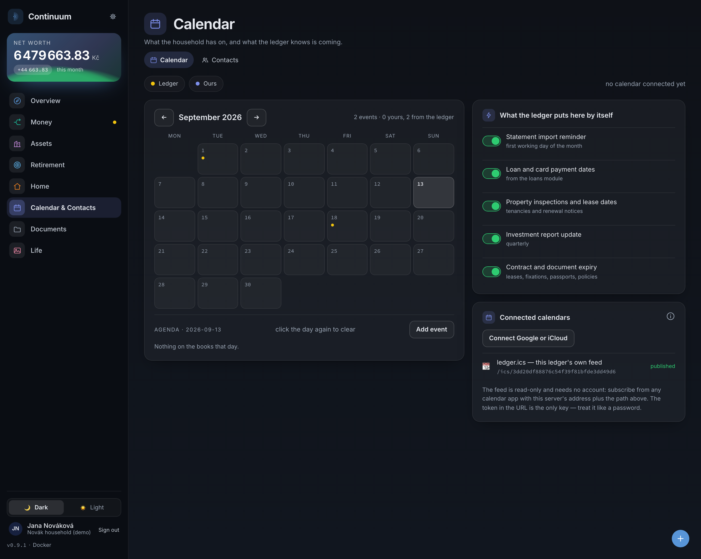
</picture>

## Contacts

Tenants, tradespeople and bank contacts, linked to what they relate to.

<picture>
  <source media="(prefers-color-scheme: dark)" srcset="screenshots/contacts-dark-web.png">
  <source media="(prefers-color-scheme: light)" srcset="screenshots/contacts-light-web.png">
  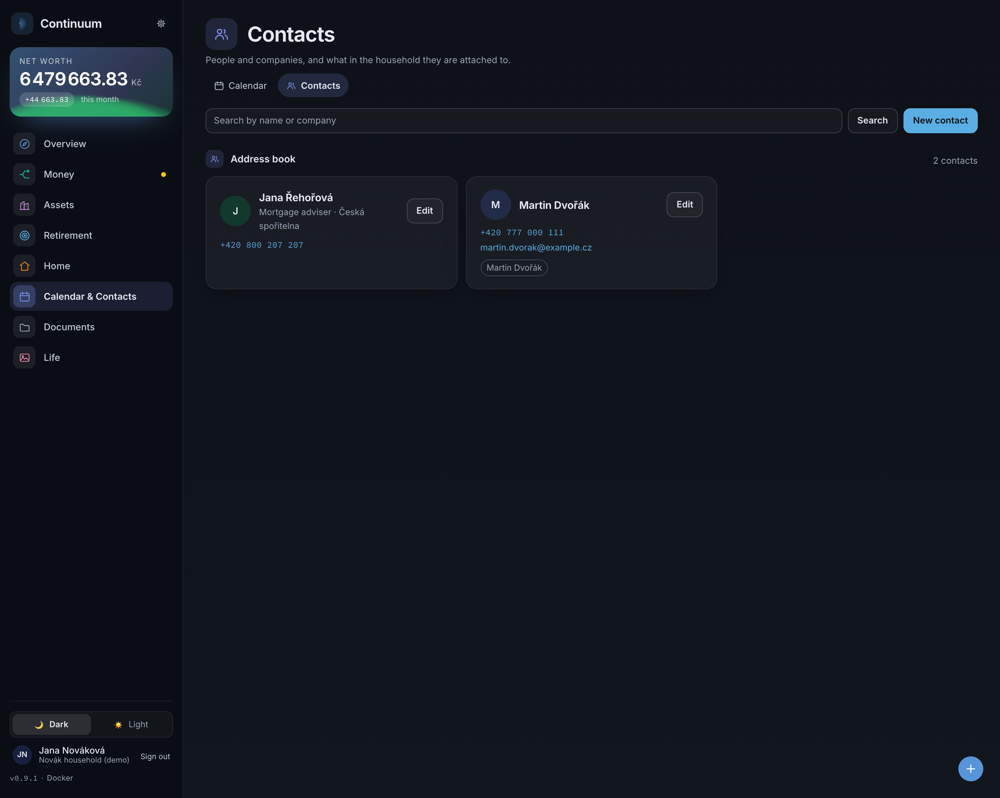
</picture>

## Documents

Filed against something real, so renames follow and expiries surface.

<picture>
  <source media="(prefers-color-scheme: dark)" srcset="screenshots/documents-dark-web.png">
  <source media="(prefers-color-scheme: light)" srcset="screenshots/documents-light-web.png">
  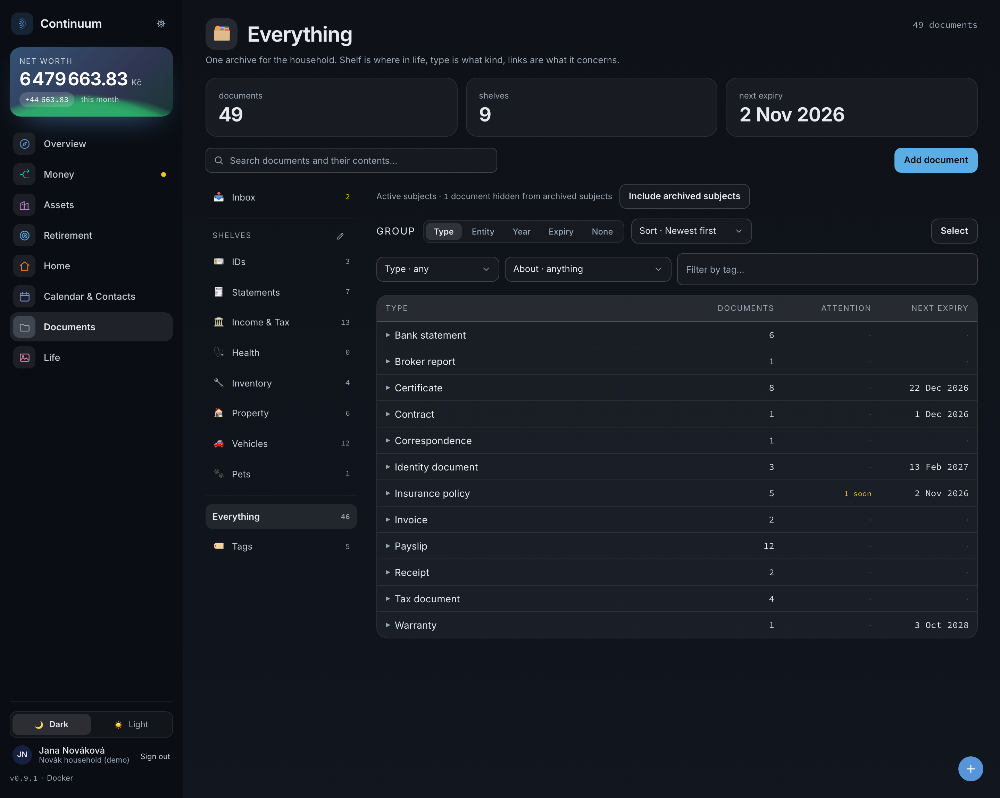
</picture>

## On a phone

Every screen reflows to one column.

<p align="center">
<picture>
  <source media="(prefers-color-scheme: dark)" srcset="screenshots/overview-dark-mobile.png">
  <source media="(prefers-color-scheme: light)" srcset="screenshots/overview-light-mobile.png">
  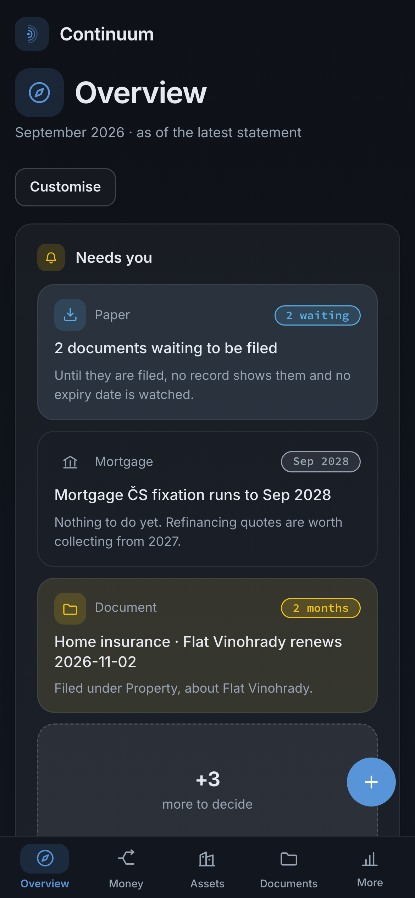
</picture>
&nbsp;
<picture>
  <source media="(prefers-color-scheme: dark)" srcset="screenshots/transactions-dark-mobile.png">
  <source media="(prefers-color-scheme: light)" srcset="screenshots/transactions-light-mobile.png">
  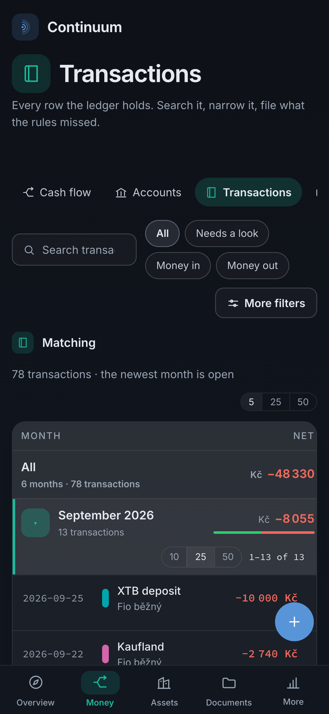
</picture>
&nbsp;
<picture>
  <source media="(prefers-color-scheme: dark)" srcset="screenshots/calendar-dark-mobile.png">
  <source media="(prefers-color-scheme: light)" srcset="screenshots/calendar-light-mobile.png">
  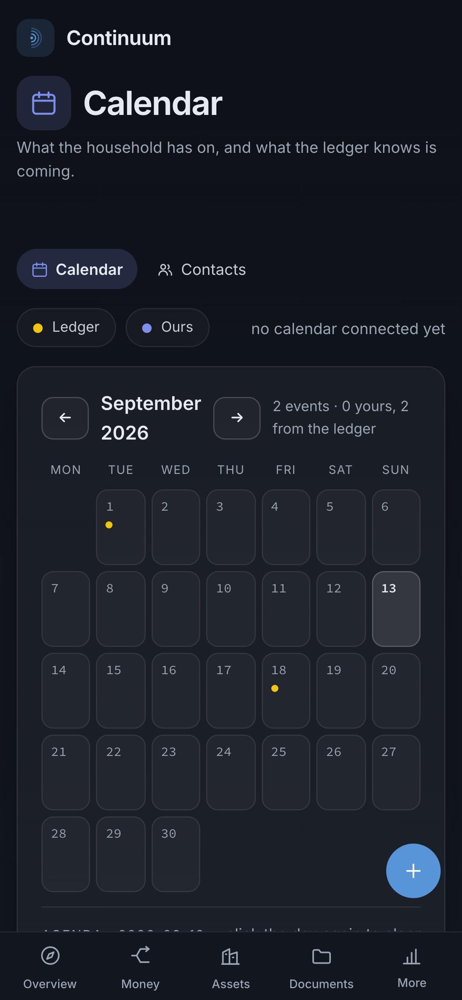
</picture>
&nbsp;
<picture>
  <source media="(prefers-color-scheme: dark)" srcset="screenshots/property-dark-mobile.png">
  <source media="(prefers-color-scheme: light)" srcset="screenshots/property-light-mobile.png">
  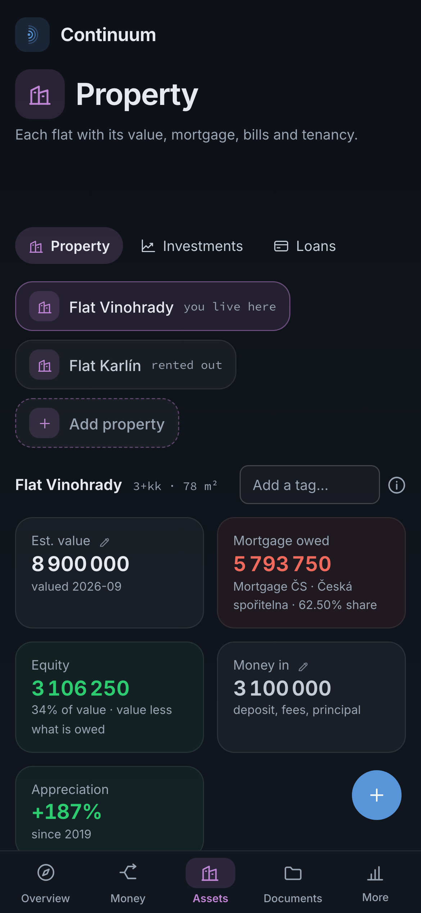
</picture>
&nbsp;
</p>
